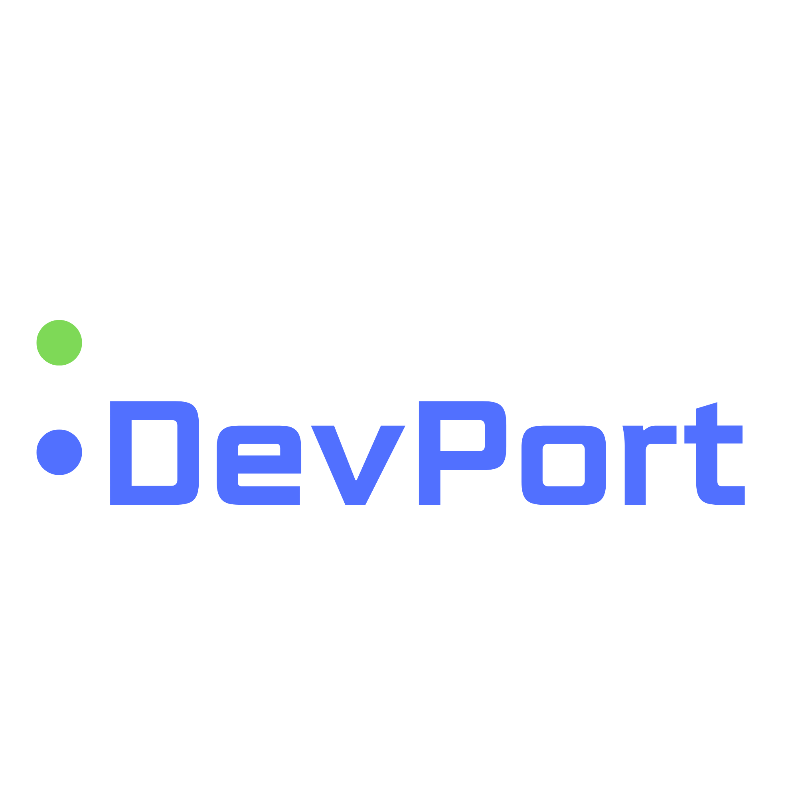

<p align="center">
  
</p>

<h1 align="center">ClickDevPort</h1>

<p align="center">
  <strong>XAMPP는 잊어라. 웹 개발 환경, 이제 클릭 한 번이면 된다.</strong>
</p>

<p align="center">
  
  
  
  
  
</p>

---

## 이런 경험, 한 번쯤 있지 않나요?

> "XAMPP 깔았는데 Apache가 안 켜진다... 포트 뭐가 충돌이래..."
>
> "프로젝트가 10개인데 하나씩 터미널 열어서 npm run dev 치는 게 너무 귀찮다..."
>
> "PHP 프로젝트랑 Node.js 프로젝트를 동시에 돌리고 싶은데..."
>
> "데이터베이스 매번 터미널에서 만들어야 하나? GUI 없나?"

**ClickDevPort**는 이 모든 문제를 해결합니다.

---

## ClickDevPort가 뭔가요?

ClickDevPort는 **Windows 전용 올인원 개발 환경 관리자**입니다.

한마디로, **XAMPP + 프로젝트 관리자 + DB 관리자 + 포트 관리자**를 하나로 합친 데스크톱 앱입니다.

### XAMPP와 뭐가 다른가요?

| 기능 | XAMPP | ClickDevPort |
|------|-------|-------------|
| Apache/MariaDB 관리 | O | O |
| Node.js/Python 프로젝트 관리 | **X** | **O** |
| 프로젝트 자동 감지 | **X** | **O** (23개+ 프레임워크) |
| 포트 충돌 감지 | **X** | **O** (실시간) |
| VS Code/터미널 바로 열기 | **X** | **O** (원클릭) |
| 커스텀 도메인 (.test) | 수동 설정 | **자동 설정** |
| 프로젝트별 DB 자동 생성 | **X** | **O** |
| 실시간 로그 스트리밍 | **X** | **O** |
| 모던 UI/다크 모드 | **X** | **O** |
| 자동 업데이트 | **X** | **O** |
| 시스템 트레이 | **X** | **O** |

---

## 주요 기능 한눈에 보기

### 1. 대시보드 - 모든 프로젝트를 한 화면에서

대시보드에서 등록된 모든 프로젝트의 상태를 한눈에 확인하고, **클릭 한 번**으로 시작/중지할 수 있습니다.

**프로젝트 통계 카드**
- 전체 프로젝트 수
- 실행 중인 프로젝트 수 (녹색 표시)
- 중지된 프로젝트 수
- 등록된 VirtualHost 수

**프로젝트별 빠른 액션 (원클릭)**

| 버튼 | 기능 |
|------|------|
| VS Code | 해당 프로젝트를 VS Code에서 바로 열기 |
| Terminal | 프로젝트 경로에서 터미널 열기 |
| Browser | 브라우저에서 `localhost:포트` 열기 |
| Explorer | 파일 탐색기에서 폴더 열기 |
| GitHub | GitHub 저장소 페이지 열기 |

**프로젝트 제어**

| 상태 | 표시 | 가능한 동작 |
|------|------|------------|
| 중지됨 | 회색 원 | ▶ 시작 |
| 실행 중 | 녹색 원 (깜빡임) | ■ 중지, ↻ 재시작 |
| 빌드 중 | 주황색 원 (깜빡임) | 경과 시간 표시 (mm:ss) |
| 오류 | 빨간 원 | 오류 메시지 표시 |

---

### 2. 서비스 관리 - Apache, MariaDB를 버튼 하나로

**Apache HTTP Server**와 **MariaDB** 같은 개발 서비스를 버튼 클릭으로 시작/중지/재시작할 수 있습니다.

**4단계 상태 모니터링**

| 상태 | 아이콘 | 의미 |
|------|--------|------|
| Running | 🟢 | 정상 실행 중 (Health Check 통과) |
| Stopped | ⚫ | 중지됨 |
| Error | 🔴 | 시작 실패 또는 크래시 |
| Unhealthy | 🟡 | 실행 중이지만 응답 없음 |

**개발 환경 인벤토리**

시스템에 설치된 모든 개발 도구를 자동으로 스캔합니다:

| 카테고리 | 감지 항목 |
|----------|----------|
| 런타임 | Node.js, PHP, Python, Ruby, Java, Go |
| 웹 서버 | Apache, Nginx, Caddy |
| 데이터베이스 | MariaDB, PostgreSQL, MongoDB, Redis |
| 빌드 도구 | Webpack, Vite, Rollup, Gulp |
| 프레임워크 | Laravel, Django, Express 등 |
| 패키지 관리자 | npm, pnpm, yarn, pip, Composer |
| 개발 도구 | Git, Docker, VS Code, Postman |

설치 소스도 자동 감지합니다 (System, DevPort, XAMPP, Laragon, Scoop, Chocolatey 등).

**phpMyAdmin 통합**
- Apache 실행 시 `http://localhost:8080/phpmyadmin`으로 자동 접근
- 상태 표시 및 응답 시간 측정
- 원클릭 브라우저 열기 버튼

---

### 3. 프로젝트 관리 - 23개+ 프레임워크 지원

#### 지원하는 프로젝트 타입

**데스크톱 앱**

| 타입 | 기본 포트 | 시작 명령어 |
|------|----------|------------|
| Tauri | 1420 | `npm run tauri dev` |
| Electron | 3000 | `npm run dev` |

**JavaScript/TypeScript 웹**

| 타입 | 기본 포트 | 시작 명령어 |
|------|----------|------------|
| Next.js | 3000 | `npm run dev` |
| Vite (React/Vue/Svelte) | 5173 | `npm run dev` |
| React (CRA) | 3000 | `npm start` |
| Vue.js | 5173 | `npm run dev` |
| Angular | 4200 | `npm start` |
| Svelte | 5173 | `npm run dev` |
| Express | 3000 | `npm start` |
| Node.js | 3000 | `npm start` |

**PHP 웹**

| 타입 | 기본 포트 | 시작 명령어 |
|------|----------|------------|
| Laravel | 8000 | `php artisan serve` |
| CodeIgniter | 8080 | `php spark serve` |

**Python 웹**

| 타입 | 기본 포트 | 시작 명령어 |
|------|----------|------------|
| Django | 8000 | `python manage.py runserver` |
| Flask | 5000 | `flask run` |
| FastAPI | 8000 | `uvicorn main:app --reload` |

**Python 데스크톱**

| 타입 | 시작 명령어 |
|------|------------|
| Tkinter | `python main.py` |
| PyQt | `python main.py` |
| wxPython | `python main.py` |
| Pygame | `python main.py` |
| Kivy | `python main.py` |

#### 프로젝트 추가 방법

**방법 1: 기존 프로젝트 가져오기 (Import)**

1. 대시보드에서 **"+ Add Project"** 클릭
2. **"Import Existing"** 탭 선택
3. 폴더 선택 버튼으로 프로젝트 폴더 선택
4. **🪄 Auto Detect** 버튼 클릭 - 자동으로 감지:
   - 프레임워크 타입 (`package.json`, `requirements.txt` 등 분석)
   - 프로젝트 이름
   - 시작 명령어
   - 기본 포트
   - GitHub URL (`.git/config`에서)
   - Python 가상환경
5. 감지 결과를 확인/수정 후 **"Add Project"** 클릭

**방법 2: 새 프로젝트 생성 (Create)**

1. **"Create New"** 탭 선택
2. 부모 폴더 선택, 프로젝트 이름 입력
3. 프레임워크 선택 (3열 그리드 버튼)
4. 패키지 매니저 선택 (npm / pnpm / yarn)
5. **"Create Project"** 클릭

#### 프로젝트 추가 옵션

| 옵션 | 설명 |
|------|------|
| 커스텀 도메인 | `myapp.test` 같은 로컬 도메인 자동 설정 |
| Health Check URL | 서비스 상태 모니터링 URL |
| 자동 시작 | 앱 시작 시 프로젝트 자동 실행 |
| 데이터베이스 생성 | 프로젝트 전용 DB + 사용자 자동 생성 |
| 실행 모드 | Web (브라우저) / App (네이티브 앱) |

---

### 4. 포트 관리 - 충돌 걱정 끝

**실시간 포트 스캐너**가 시스템의 모든 사용 중인 포트를 모니터링합니다.

| 표시 정보 | 설명 |
|----------|------|
| Port | 포트 번호 |
| PID | 프로세스 ID |
| Process | 프로세스 이름 |
| Protocol | TCP / UDP |
| State | LISTENING, ESTABLISHED 등 |

**포트 충돌 방지**
- 프로젝트 추가/편집 시 실시간 포트 가용성 확인
- 🟢 Available (사용 가능) / 🟡 In use (충돌) 표시
- 사용 가능한 대체 포트 자동 제안
- 다른 프로젝트, Apache VirtualHost, 시스템 서비스와의 충돌 감지

---

### 5. 로그 뷰어 - 실시간으로 모든 로그 확인

**2패널 레이아웃**으로 서비스와 프로젝트의 로그를 실시간으로 확인합니다.

| 기능 | 설명 |
|------|------|
| 실시간 스트리밍 | 새 로그가 자동으로 추가됨 |
| 로그 레벨 색상 | info(파랑), success(초록), warning(노랑), error(빨강) |
| 서비스별 색상 | Apache(주황), MariaDB(파랑), System(보라) |
| 자동 스크롤 | 최신 로그로 자동 이동 |
| 검색/필터 | 로그 내용 검색 |
| 다운로드 | 로그 파일 저장 |

**로그 로테이션 설정**

| 설정 | 범위 | 기본값 |
|------|------|--------|
| 최대 파일 크기 | 10-500 MB | 50 MB |
| 보관 파일 수 | 1-100개 | 10개 |
| 보관 기간 | 1-365일 | 30일 |
| 자동 정리 | On / Off | On |

**하단 고정 활동 로그**

메인 화면 하단에 접이식 활동 로그 패널이 있어, 어떤 화면에서든 서비스 활동을 확인할 수 있습니다.

---

### 6. 설치 관리자 - 필요한 도구를 한 번에

설치 마법사가 Apache, MariaDB, Node.js, PHP, Python 등 개발에 필요한 모든 도구를 자동으로 설치합니다.

**설치 프리셋**

| 프리셋 | 포함 컴포넌트 |
|--------|-------------|
| 웹 개발 기본 | Apache + MariaDB + PHP + Node.js |
| 프론트엔드 전용 | Node.js + npm + Git |
| 풀스택 | 모든 주요 컴포넌트 |
| 사용자 정의 | 원하는 것만 골라서 설치 |

**설치 과정**

```
Step 1: 프리셋 선택
         ↓
Step 2: 컴포넌트 개별 선택/해제
         ↓
Step 3: 자동 설치 (진행률 + 실시간 로그)
         ↓
Step 4: 완료 확인
```

설치 후 자동 수행:
- PATH 환경변수 설정
- PHP INI 파일 구성
- Apache 모듈 연동
- 데이터베이스 초기화
- 설치 검증

---

### 7. Apache VirtualHost 관리

대시보드에서 Apache VirtualHost를 GUI로 관리합니다.

**VirtualHost 추가**
1. 도메인 이름 입력 (예: `myapp.test`)
2. Document Root 선택
3. 포트 번호 설정
4. 저장 후 Apache 재시작

자동으로 처리되는 작업:
- `httpd-vhosts.conf` 파일에 설정 추가
- hosts 파일에 도메인 매핑 (`127.0.0.1 myapp.test`)
- Apache 재시작 필요 알림 표시

---

### 8. 커스텀 도메인 & Hosts 파일 관리

`localhost:3000` 대신 `myapp.test`처럼 깔끔한 도메인으로 접속할 수 있습니다.

**지원 TLD (최상위 도메인)**

| TLD | 설명 |
|-----|------|
| `.test` | 권장 - ICANN 예약 도메인 |
| `.localhost` | 로컬 전용 |
| `.local` | mDNS 호환 |

**자동 관리**
- 프로젝트에 도메인 설정 시 hosts 파일에 자동 추가
- 프로젝트 삭제 시 자동 제거
- 고아 항목 (삭제된 프로젝트의 남은 도메인) 감지 및 정리

---

### 9. 데이터베이스 관리

프로젝트 생성 시 **"Create database"** 옵션만 켜면, 전용 데이터베이스가 자동으로 만들어집니다.

| 자동 생성 항목 | 예시 |
|--------------|------|
| 데이터베이스 | `my_blog` |
| 전용 사용자 | `my_blog_user` |
| 비밀번호 | 16자리 자동 생성 |
| 권한 | 해당 DB 전체 권한 |

**phpMyAdmin 통합**
- Apache 실행 시 `http://localhost:8080/phpmyadmin`에서 GUI로 DB 관리
- 상태 확인 및 원클릭 열기

**MariaDB 보안**
- `127.0.0.1` 바인딩 (외부 접근 차단)
- 비밀번호 DPAPI 암호화 저장
- phpMyAdmin은 localhost에서만 접근 가능

---

### 10. 환경 변수 (.env) 편집기

프로젝트의 `.env` 파일을 GUI로 편집합니다. 터미널에서 직접 수정할 필요가 없습니다.

**프로파일 지원**

| 프로파일 | 파일 |
|----------|------|
| 기본 | `.env` |
| 개발 | `.env.development` |
| 스테이징 | `.env.staging` |
| 프로덕션 | `.env.production` |

**기능**
- 변수 추가/편집/삭제
- 비밀값 마스킹 (눈 아이콘으로 토글)
- 클립보드 복사
- 변경 사항 자동 감지 및 저장/취소

---

### 11. 설정

**일반 설정**

| 설정 | 옵션 |
|------|------|
| 테마 | Dark / Light / System |
| 언어 | 한국어, English, 日本語, 中文 |
| 트레이로 닫기 | X 버튼 시 트레이로 최소화 |
| 알림 | 서비스 상태 변경 시 데스크톱 알림 |

**자동 시작**

| 설정 | 설명 |
|------|------|
| Windows 시작 시 실행 | 부팅 시 앱 자동 실행 |
| 최소화 상태로 시작 | 트레이로 시작 |
| Apache 자동 시작 | 앱 시작 시 Apache 자동 실행 |
| MariaDB 자동 시작 | 앱 시작 시 MariaDB 자동 실행 |

**PATH 관리**

DevPort로 설치한 런타임을 시스템 PATH에 추가하여, 외부 터미널에서도 사용 가능:
- Node.js (`C:\DevPort\nodejs`)
- PHP (`C:\DevPort\php`)
- Git (`C:\DevPort\git`)
- Composer (`C:\DevPort\composer`)

**백업 및 복원**
- 프로젝트 목록, 앱 설정, 서비스 설정을 백업
- 백업 파일에서 복원
- 저장 위치: `내 문서\ClickDevPort Backups\`

**자동 업데이트**
- GitHub Releases 기반 업데이트 확인
- 릴리스 노트 확인
- 다운로드 진행률 표시
- 원클릭 설치 및 재시작

---

### 12. 시스템 트레이

X 버튼으로 앱을 닫아도 시스템 트레이에서 계속 실행됩니다.

- 실행 중인 서비스 수 표시
- 트레이 아이콘 클릭으로 창 표시/숨기기
- 서비스가 백그라운드에서 계속 유지

---

### 13. 복구 및 안전 기능

**자동 복구**
- 앱 비정상 종료 시 세션 상태 자동 복원
- 고아 프로세스 자동 정리
- PID 유효성 검증

**삭제 기능 (3단계)**

| 모드 | 설명 |
|------|------|
| 기본 삭제 | 앱만 제거, 데이터 유지 |
| 전체 삭제 | 앱 + 모든 데이터 제거 |
| 시스템 복원 | PATH 등 시스템 변경사항까지 원복 |

---

## 시스템 요구사항

### 최소 사양

| 항목 | 요구사항 |
|------|----------|
| 운영체제 | Windows 10 64-bit 이상 |
| 메모리 | 4GB RAM |
| 저장공간 | 2GB 이상 |
| 화면 해상도 | 1280 x 720 이상 |

### 권장 사양

| 항목 | 요구사항 |
|------|----------|
| 운영체제 | Windows 11 |
| 메모리 | 8GB RAM 이상 |
| 저장공간 | SSD 10GB 이상 |
| 화면 해상도 | 1920 x 1080 이상 |

---

## 설치 방법

### 1. 다운로드

[GitHub Releases](https://github.com/for302/devport/releases)에서 최신 버전을 다운로드합니다.

- `ClickDevPort_x.x.x_x64-setup.exe` (NSIS 설치 파일)
- `ClickDevPort_x.x.x_x64_en-US.msi` (MSI 설치 파일)

### 2. 설치

1. 다운로드한 설치 파일 실행
2. 설치 경로 확인 (기본: `C:\DevPort\`)
3. 바탕화면/시작 메뉴 바로가기 생성 확인
4. 설치 완료

### 3. 첫 실행

앱을 처음 실행하면 **설치 마법사**가 나타납니다:

1. **프리셋 선택** - 개발 환경에 맞는 프리셋 선택
2. **컴포넌트 선택** - 필요한 도구를 개별 선택/해제
3. **자동 설치** - 다운로드 및 설치 진행 (진행률 표시)
4. **완료** - 설치된 도구 목록 확인

> 설치 마법사는 "건너뛰기" 버튼으로 나중에 진행할 수 있습니다.

---

## 빠른 시작 가이드

### 기존 프로젝트를 5초 만에 등록하기

```
1. 좌측 사이드바 하단의 "+ Add Project" 클릭
2. "Import Existing" 탭에서 폴더 선택
3. 🪄 Auto Detect 클릭 (자동 감지!)
4. "Add Project" 클릭
5. 대시보드에서 ▶ 버튼 클릭 → 끝!
```

### Apache + MariaDB 시작하기

```
1. 좌측 사이드바 하단의 서비스 제어 섹션 확인
2. Apache 옆의 ▶ 버튼 클릭
3. MariaDB 옆의 ▶ 버튼 클릭
4. 브라우저에서 http://localhost:8080 확인 → 끝!
```

### 커스텀 도메인 설정하기

```
1. 프로젝트 추가/편집 시 "Custom Domain" 활성화
2. 도메인 입력 (예: myapp.test)
3. 저장 → hosts 파일에 자동 등록
4. 브라우저에서 http://myapp.test 접속 → 끝!
```

---

## 주요 경로

| 경로 | 용도 |
|------|------|
| `C:\DevPort\` | 컴포넌트 설치 경로 |
| `%APPDATA%\devport-manager\` | 앱 설정 저장 |
| `C:\DevPort\logs\` | 로그 파일 |
| `내 문서\ClickDevPort Backups\` | 백업 파일 |

---

## 기본 포트

| 서비스/프레임워크 | 포트 |
|------------------|------|
| Apache | 8080 |
| MariaDB | 3306 |
| phpMyAdmin | 8080/phpmyadmin |
| Tauri | 1420 |
| Vite / Vue / Svelte | 5173 |
| React / Next.js / Express | 3000 |
| Angular | 4200 |
| Django / FastAPI / Laravel | 8000 |
| Flask | 5000 |

---

## 문제 해결

### Apache가 시작되지 않아요

1. **Ports** 탭에서 8080 포트 사용 여부 확인
2. IIS, Nginx 등 다른 웹 서버가 실행 중인지 확인
3. **Logs** 탭에서 Apache 에러 로그 확인

### MariaDB가 시작되지 않아요

1. 3306 포트가 다른 MySQL 인스턴스에서 사용 중인지 확인
2. 데이터 디렉토리 권한 확인
3. 로그에서 에러 메시지 확인

### 프로젝트가 실행되지 않아요

1. 시작 명령어가 올바른지 확인
2. 해당 런타임(Node.js, Python 등)이 설치되었는지 확인
3. 의존성이 설치되었는지 확인 (`npm install` 등)
4. 프로젝트 경로가 정확한지 확인

### 포트 충돌이 발생해요

1. **Ports** 탭에서 충돌 포트와 사용 프로세스 확인
2. 해당 프로세스를 종료하거나
3. 프로젝트의 포트를 변경

### Hosts 파일 수정이 안 돼요

1. 앱을 **관리자 권한**으로 실행
2. 안티바이러스 프로그램에서 예외 추가
3. hosts 파일이 읽기 전용인지 확인

### 설정 초기화

- **부분 초기화**: Settings → "Reset to Defaults" 클릭
- **완전 초기화**: `%APPDATA%\devport-manager\` 폴더 삭제 후 앱 재시작

---

## 기술 스택

| 구분 | 기술 |
|------|------|
| 데스크톱 프레임워크 | [Tauri 2.x](https://tauri.app/) (Rust + WebView) |
| 프론트엔드 | [React 19](https://react.dev/) + TypeScript |
| 빌드 도구 | [Vite 6](https://vitejs.dev/) |
| UI 스타일링 | [Tailwind CSS 4](https://tailwindcss.com/) |
| 상태 관리 | [Zustand 5](https://zustand-demo.pmnd.rs/) + Immer |
| 아이콘 | [Lucide React](https://lucide.dev/) |

---

## 개발 환경 설정 (Contributing)

### 사전 요구사항

- [Node.js](https://nodejs.org/) 18+
- [Rust](https://www.rust-lang.org/tools/install) (stable)
- [Tauri CLI](https://tauri.app/start/prerequisites/)

### 로컬 개발

```bash
# 저장소 클론
git clone https://github.com/for302/devport.git
cd devport

# 의존성 설치
npm install

# 개발 모드 실행
npm run tauri dev

# 프로덕션 빌드
npm run tauri build

# Rust 컴파일 체크
cargo check

# TypeScript 타입 체크
npx tsc --noEmit
```

---

## 라이선스

MIT License - 자유롭게 사용, 수정, 배포할 수 있습니다.

---

## 지원

- **GitHub Issues**: [버그 리포트 / 기능 제안](https://github.com/for302/devport/issues)
- **Releases**: [최신 버전 다운로드](https://github.com/for302/devport/releases)

---

<p align="center">
  <strong>ClickDevPort</strong> - 개발 환경의 새로운 기준
</p>
